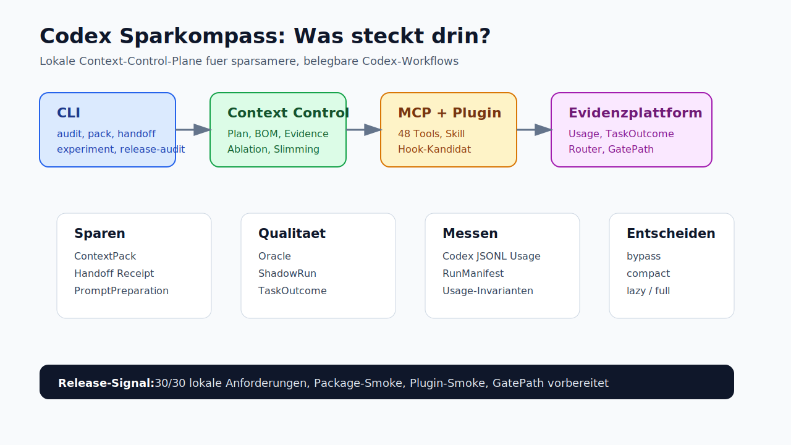
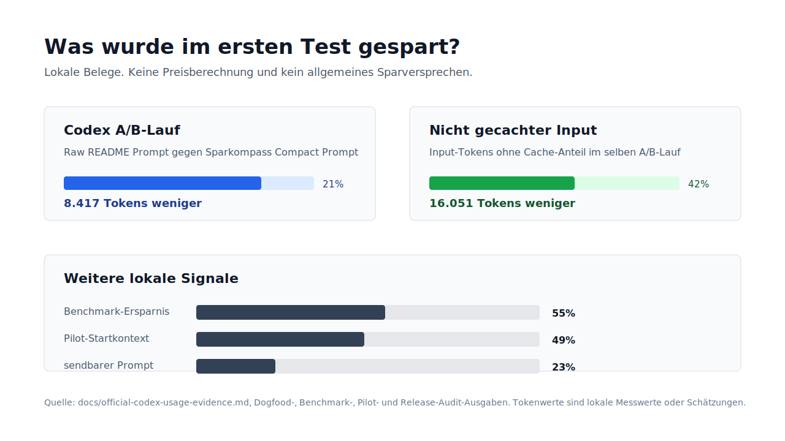
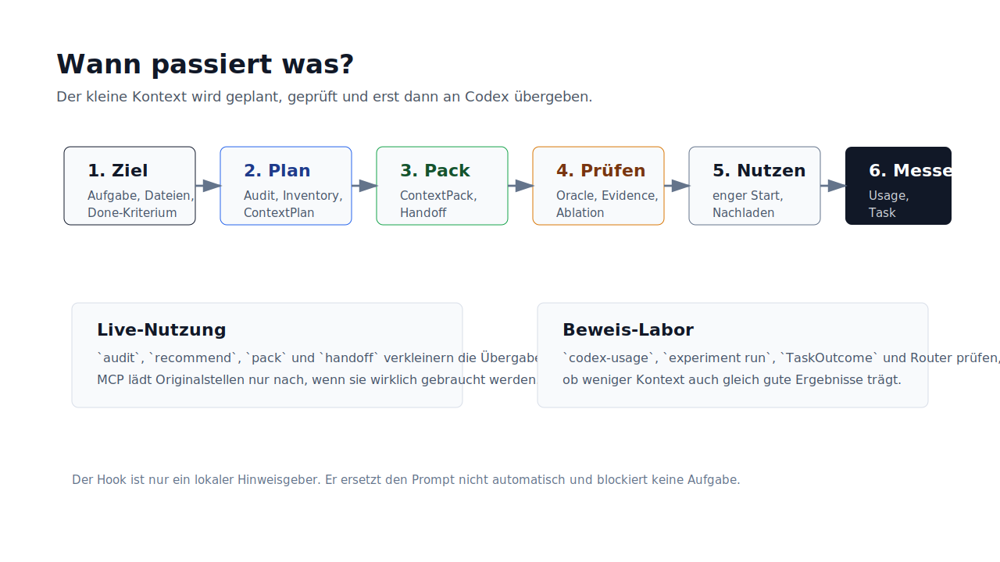
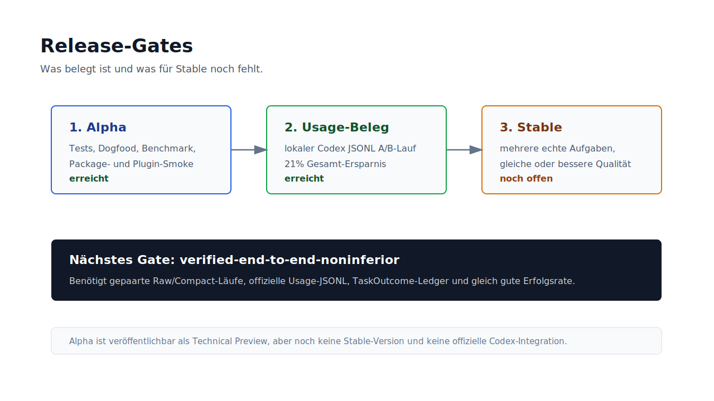

# Codex Sparkompass



**Status:** `v0.1.0-alpha` Technical Preview.

Codex Sparkompass ist eine lokale Context-Control-Plane für Codex-Workflows. Das Tool hilft, vor einem Codex-Lauf weniger unnötigen Kontext zu senden, wichtige Fakten zu schützen, Originalstellen später gezielt nachzuladen und Einsparungen mit Qualitätsgates zu verbinden.

Sparkompass ist kein Token-Hack, kein Preisrechner und keine offizielle Abrechnung. Es bereitet kleinere, belegbare Inhalte vor. Der interne Codex-Request an OpenAI wird nicht heimlich verändert.

## Warum es das gibt

Codex wird teuer und unübersichtlich, wenn ganze Repos, lange Logs, große README-Dateien oder alte Tool-Ausgaben ungefiltert im Kontext landen. Sparkompass setzt davor eine lokale Prüfschicht:

- erst relevante Dateien und semantische Einheiten finden
- große Inhalte als ContextPack oder Handoff-Receipt verdichten
- Muss-Fakten, Fehlercodes und Pfade mit Receipts schützen
- bei Unsicherheit auf mehr Kontext oder Vollkontext zurückfallen
- offizielle Codex-JSONL-Usage und lokale TaskOutcomes als Evidenz sammeln
- automatisch zwischen `bypass`, `compact`, `lazy` und `full` vorbereiten

## Erste Messwerte



| Beleg | Ergebnis |
| --- | ---: |
| Lokaler Codex A/B-Lauf, Gesamt-Tokens | `8.417` weniger, `21%` Ersparnis |
| Lokaler Codex A/B-Lauf, nicht gecachter Input | `16.051` weniger, `42%` Ersparnis |
| Benchmark-Ersparnis | `55%` |
| Pilot-Startkontext-Ersparnis | `49%` |
| Pilot-sendbare-Prompt-Ersparnis | `23%` |

Die Codex-Zahlen stammen aus dokumentierten `codex exec --json` Usage-Events und sind in [docs/official-codex-usage-evidence.md](docs/official-codex-usage-evidence.md) beschrieben. Sie sind ein lokaler Laufbeleg, keine Rechnung und kein allgemeines Sparversprechen.

## Schnellstart

```bash
git clone https://github.com/Tobinat/codex-sparkompass.git
cd codex-sparkompass
npm ci
npm run check
node ./bin/codex-sparkompass.mjs audit .
```

Optional lokal global verlinken:

```bash
npm link
sparkompass doctor
sparkompass audit .
```

Mehr Installationswege stehen in [INSTALL.md](INSTALL.md).

## Häufige Nutzung

### Repository prüfen

```bash
sparkompass audit .
```

Zeigt Kontext-Ampel, große Kontexttreiber und konkrete Hinweise.

### Nächsten Codex-Lauf vorbereiten

```bash
sparkompass recommend . \
  --goal "Login-Fehler nach Passwort-Reset beheben" \
  --file "src/auth/session.ts" \
  --done "Auth-Tests laufen grün"
```

Erzeugt eine knappe Empfehlung plus einen engeren Prompt.

### Große Eingabe sicher verdichten

```bash
sparkompass pack \
  --file "debug.log" \
  --keep "AUTH_RESET_TOKEN_EXPIRED" \
  --expect "Auth reset test passes"
```

`pack` erzeugt ein `ContextPackReceiptV1`. Wenn wichtige Fakten fehlen, erweitert Sparkompass den Kontext oder fällt auf Vollkontext zurück.

### Handoff mit Sparbalken bauen

```bash
sparkompass handoff . \
  --goal "Login-Fehler beheben" \
  --expect "AUTH_RESET_TOKEN_EXPIRED" \
  --budget 800 \
  --print-prompt
```

Der Handoff zeigt Startprompt, lokale Token-Schätzung, Qualitätsvertrag und Nachlade-Belege.

## Was drin ist



- **CLI:** Audit, Recommend, Pack, Handoff, Experiment, Router, Release-Audit.
- **Skill:** `.agents/skills/codex-sparkompass` sagt Codex, wann es das CLI nutzen soll.
- **Plugin-Kandidat:** `plugins/codex-sparkompass` bündelt Skill, MCP-Server und Hook-Kandidat.
- **MCP-Server:** `sparkompass-mcp` lädt Originalstellen, Symbolumfelder, ContextPacks und Evidence gezielt nach.
- **Hook-Kandidat:** erkennt große Prompts lokal und empfiehlt `tool-output`, `pack` oder `handoff`, ohne Prompt-Inhalte zu spiegeln.
- **Evidenzplattform:** Usage-Invarianten, RunManifests, TaskOutcomes, Scorecard und Release-Audit.

Nicht enthalten:

- keine Telemetrie
- kein Upload von Repo-Inhalten
- kein automatisches Umschreiben des Codex-Prompts
- keine Behauptung, offiziell in Codex integriert zu sein

## Release-Status



Diese Alpha ist als GitHub Technical Preview veröffentlichbar. Stable ist erst sinnvoll, wenn mehrere echte Aufgaben mit gepaarten Raw/Compact-Läufen, offiziellen Codex-Usage-JSONL-Dateien und gleicher oder besserer Erfolgsrate belegt sind.

Aktueller lokaler Stand:

- Tests: `227/227`
- Release-Audit: `30/30`
- Package-Audit: `verified-package-dry-run`
- Package-Smoke: `verified-package-install-smoke`
- Plugin-Smoke: `verified-plugin-install-smoke`
- Router-Probe: `compact`
- GatePath: `verified-gate-path-prepared`

## Dokumentation

- [docs/usage.md](docs/usage.md): praktische Befehle und Workflows
- [docs/evidence.md](docs/evidence.md): Messwerte, Gates und Einordnung
- [docs/quality-model.md](docs/quality-model.md): Qualitätsmodell und Receipts
- [docs/release-checklist.md](docs/release-checklist.md): Release-Gates
- [docs/publishing.md](docs/publishing.md): GitHub-Release-Runbook

## Grenzen

- Tokenwerte sind lokale Schätzungen oder lokale Usage-Belege, keine Abrechnung.
- `compress` ist verlustbehaftet; für belastbare Übergaben ist `pack` besser.
- Das Tool weiß nicht automatisch, welche Datei fachlich relevant ist.
- Review, Tests und Sicherheitsprüfung bleiben nötig.
- Offizielle Nutzung und Abrechnung stehen in OpenAI-Dashboards oder Workspace-Analytics.

## Quellen

- [Codex Pricing](https://developers.openai.com/codex/pricing)
- [Codex Best Practices](https://developers.openai.com/codex/learn/best-practices)
- [Codex Prompting](https://developers.openai.com/codex/prompting)
- [Custom instructions with AGENTS.md](https://developers.openai.com/codex/guides/agents-md)
- [Agent Skills](https://developers.openai.com/codex/skills)
- [Model Context Protocol in Codex](https://developers.openai.com/codex/mcp)
- [OpenAI Prompt Caching](https://developers.openai.com/api/docs/guides/prompt-caching)
